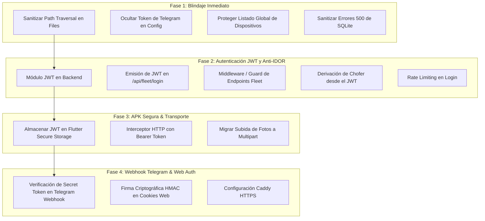

# Plan Maestro de Seguridad, Autenticación y Optimización de APIs (Fleet & Web)

Este plan detalla el paso a paso para corregir las vulnerabilidades críticas identificadas en la auditoría técnica (`docs/INFORME_MEJORA_API_SYNC.md`), proteger los endpoints expuestos a Internet y optimizar el rendimiento de la aplicación móvil y el servidor.

---

## User Review Required

> [!IMPORTANT]
> **Estrategia de Cero Interrupción (Zero Downtime / Retrocompatibilidad):**
> Durante la transición, los choferes que estén en ruta con versiones anteriores del APK no deben quedar desconectados. Se implementará un **Switch de Seguridad (Feature Flag)** en backend:
> 1. **Modo Permisivo (Transición):** Acepta llamadas con JWT (nuevas) o sin JWT validando HWID, mientras todos los teléfonos se actualizan vía OTA.
> 2. **Modo Estricto (Producción Final):** Rechaza con `401 Unauthorized` cualquier petición sin JWT válido y sin API Key oficial.

---

## Fases de Implementación Propuestas

---

## Proposed Changes

### FASE 1: Blindaje Inmediato de Backend (Sin impacto en el APK actual)

#### [MODIFY] [route.ts](file:///C:/Proyectos_Clic/Garend/IntraTool_Gravity_Entregas/IntraTool_Unificado_Grav/src/app/api/fleet/files/%5Bfilename%5D/route.ts)
* **[S3] Prevenir Path Traversal:** Sanitizar el parámetro con `path.basename()` y comprobar que `path.resolve(filePath).startsWith(UPLOAD_DIR)`.

#### [MODIFY] [route.ts](file:///C:/Proyectos_Clic/Garend/IntraTool_Gravity_Entregas/IntraTool_Unificado_Grav/src/app/api/fleet/config/route.ts)
* **[S5] Ocultar Secretos:** Eliminar el campo `telegram_bot_token` de la respuesta JSON pública.

#### [MODIFY] [route.ts](file:///C:/Proyectos_Clic/Garend/IntraTool_Gravity_Entregas/IntraTool_Unificado_Grav/src/app/api/fleet/device-config/route.ts)
* **[S4] Proteger Dispositivos:** Proteger la opción `?list=true` para que solo responda a administradores autenticados desde el panel web.

#### [MODIFY] [driver-actions/route.ts](file:///C:/Proyectos_Clic/Garend/IntraTool_Gravity_Entregas/IntraTool_Unificado_Grav/src/app/api/fleet/driver-actions/route.ts)
* **[Q11] Validar Vehículo en Uso en `start_route`:** Validar que el `vehiculoId` no esté ya asignado a otra ruta activa del día (`ops_delivery_assignments.activa = 1`).
* **[Q12] Longitud Mínima en `autoload_invoice`:** Requerir al menos 4 caracteres en la búsqueda `LIKE` para evitar cargar facturas incorrectas por coincidencia de 2 caracteres.

#### [MODIFY] [Múltiples route handlers en /src/app/api/fleet/*](file:///C:/Proyectos_Clic/Garend/IntraTool_Gravity_Entregas/IntraTool_Unificado_Grav/src/app/api/fleet/)
* **[S8] Sanitizar Errores 500:** Reemplazar `error: error.message` por un mensaje genérico seguro y loguear el stack trace internamente en `logError()`.

---

### FASE 2: Autenticación JWT, Anti-IDOR y Corrección de Datos

#### [NEW] [src/modules/core/lib/jwt-service.ts](file:///C:/Proyectos_Clic/Garend/IntraTool_Gravity_Entregas/IntraTool_Unificado_Grav/src/modules/core/lib/jwt-service.ts)
* Implementar generación y verificación de tokens JWT usando `jose` o `jsonwebtoken` con expiración configurable (ej. 7 días) y firma por clave secreta en `.env` / base de datos.

#### [MODIFY] [route.ts](file:///C:/Proyectos_Clic/Garend/IntraTool_Gravity_Entregas/IntraTool_Unificado_Grav/src/app/api/fleet/login/route.ts)
* **[S7] Rate Limiting:** Al validar contraseña con éxito, retornar `{ success: true, token: "jwt...", user: { ... } }`. Contador de intentos fallidos para rate limiting de fuerza bruta.

#### [NEW] [src/modules/fleet/lib/fleet-auth-guard.ts](file:///C:/Proyectos_Clic/Garend/IntraTool_Gravity_Entregas/IntraTool_Unificado_Grav/src/modules/fleet/lib/fleet-auth-guard.ts)
* Función guard para route handlers que extrae el token del header `Authorization: Bearer <token>`, lo valida y devuelve los datos del usuario autenticado (`userId`, `role`, `hardwareId`).

#### [MODIFY] [route.ts](file:///C:/Proyectos_Clic/Garend/IntraTool_Gravity_Entregas/IntraTool_Unificado_Grav/src/app/api/fleet/driver-routes/route.ts) & [route.ts](file:///C:/Proyectos_Clic/Garend/IntraTool_Gravity_Entregas/IntraTool_Unificado_Grav/src/app/api/fleet/driver-actions/route.ts)
* **[S1] Anti-IDOR:** Usar `fleet-auth-guard` para obtener el `userId` real del token y prevenir suplantación de identidad.

---

### FASE 3: Actualización del Cliente Flutter (APK) & Fixes de Lógica

#### [MODIFY] [delivery_doc.dart](file:///C:/Proyectos_Clic/Garend/IntraTool_Gravity_Entregas/IntraTool_Unificado_Grav/Android/lib/models/delivery_doc.dart)
* **[Q2] Corrección de Cantidades en Líneas Pendientes:** En `DeliveryLine.fromJson`, corregir `entregada: parseQty(j['entregada'] ?? 0)` (en lugar de `j['cantidad']`) para que una línea pendiente no aparezca erróneamente como 100% entregada.
* **[Q1] Unificación de Consecutivo de Boleta:** Sincronizar el consecutivo oficial con el servidor o reservar rangos para evitar colisiones offline con `BOL-XXXXXX`.

#### [MODIFY] [api_service.dart](file:///C:/Proyectos_Clic/Garend/IntraTool_Gravity_Entregas/IntraTool_Unificado_Grav/Android/lib/services/api_service.dart)
* Almacenar y leer el JWT en almacenamiento persistente seguro (`flutter_secure_storage`).
* Inyectar automáticamente el header `Authorization: Bearer <token>` y la cabecera `X-Fleet-Api-Key` en todas las peticiones HTTP.
* En caso de recibir `401 Unauthorized`, limpiar sesión y redirigir a `LoginScreen`.

#### [MODIFY] [app_logger.dart](file:///C:/Proyectos_Clic/Garend/IntraTool_Gravity_Entregas/IntraTool_Unificado_Grav/Android/lib/services/app_logger.dart)
* **[Q3] Redacción de Secretos en Logs:** Ocultar/enmascarar automáticamente PINs de admin (`PIN=****`) y tokens antes de persistir o sincronizar logs al servidor.

#### [MODIFY] [native_printer_service.dart](file:///C:/Proyectos_Clic/Garend/IntraTool_Gravity_Entregas/IntraTool_Unificado_Grav/Android/lib/services/native_printer_service.dart)
* **[Q4 & Q8] Impresión Bluetooth Segura:** Aumentar timeout de impresión a 10s para gráficos/firmas y asegurar reconexión a la MAC guardada en lugar de saltar a `paired.first`.

#### [MODIFY] [photo_storage_service.dart](file:///C:/Proyectos_Clic/Garend/IntraTool_Gravity_Entregas/IntraTool_Unificado_Grav/Android/lib/services/photo_storage_service.dart) & [api_service.dart](file:///C:/Proyectos_Clic/Garend/IntraTool_Gravity_Entregas/IntraTool_Unificado_Grav/Android/lib/services/api_service.dart)
* **[S9] Transporte Multipart:** Implementar subida binaria mediante `http.MultipartRequest` para fotos de evidencia/factura en lugar de strings Base64 gigantes.

---

### FASE 4: Hardening de Webhook Telegram y Sesiones Web

#### [MODIFY] [route.ts](file:///C:/Proyectos_Clic/Garend/IntraTool_Gravity_Entregas/IntraTool_Unificado_Grav/src/app/api/telegram/webhook/route.ts)
* Validar el header `X-Telegram-Bot-Api-Secret-Token` contra el secreto configurado en el sistema antes de procesar cualquier mensaje o comando.

#### [MODIFY] [auth.ts](file:///C:/Proyectos_Clic/Garend/IntraTool_Gravity_Entregas/IntraTool_Unificado_Grav/src/modules/core/lib/auth.ts)
* Firmar la cookie `clic-tools-session` con HMAC-SHA256 (`userId.timestamp.signature`) para evitar alteración manual de cookies en el navegador.

---

## Verification Plan

### Automated Tests
1. **TypeScript Typecheck:**
   * Ejecutar `cmd.exe /c "npx tsc --noEmit"` para certificar que todos los tipos y rutas de Next.js compilen sin errores.
2. **Compilación Flutter APK:**
   * Ejecutar `flutter build apk --release` para validar la integración de los interceptores HTTP y almacenamiento seguro.

### Manual Verification
1. **Prueba de Seguridad IDOR:**
   * Intentar hacer `curl http://localhost:9001/api/fleet/driver-routes?userId=2` sin token y verificar que retorne `401 Unauthorized`.
   * Hacer la petición con el JWT del Chofer 1 y comprobar que solo devuelva las entregas del Chofer 1 aunque en la URL se pida el Chofer 2.
2. **Prueba de Path Traversal:**
   * Intentar descargar `http://localhost:9001/api/fleet/files/../../package.json` y verificar que devuelva `403 Forbidden` o `404 Not Found`.
3. **Prueba de Flujo Completo APK en Celular:**
   * Iniciar sesión en el APK, verificar recepción del JWT y realizar un ciclo de entrega con firma y fotos por multipart.
